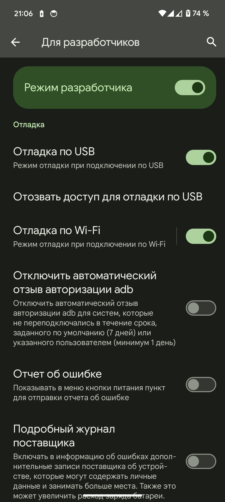
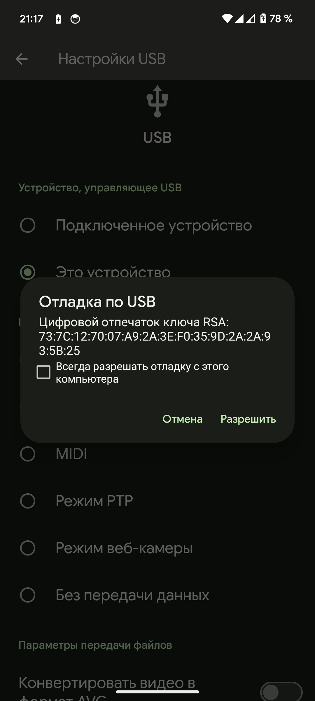

# 🔧 ADB

Большинство телефонов на рынке работают под управлением Android, и многие предпочитают его как более открытую операционную систему, чем iOS от Apple. Однако к некоторым функциям ОС Google можно получить доступ только через пути и методы, которые скрыты от обычного пользователя. Однако ко многим из этих возможностей можно получить доступ с помощью Android Debug Bridge (ADB).&#x20;

## Что такое Android Debug Bridge (ADB) и как это работает? <a href="#what-is-the-android-debug-bridge-adb" id="what-is-the-android-debug-bridge-adb"></a>

ADB — это инструмент, предоставляемый Google разработчикам для отладки и тестирования своего программного обеспечения на телефонах Android. Он обеспечивает доступ к определенным функциям, которые недоступны обычным пользователям, и поскольку технически любой может использовать ADB, у вас есть возможность использовать эти расширенные функции, даже если вы не являетесь разработчиком.

Внутренняя структура ADB основана на классической архитектуре клиент-сервер. Есть три компонента, которые составляют весь процесс.

1. Клиент, то есть ПК/Mac/Chromebook, который вы подключили к своему устройству Android. Мы отправляем команды на наше устройство с компьютера через USB-кабель или по беспроводной сети.
2. Демон (известный как «adbd»), выполняющий команды на устройстве. Демон работает как фоновый процесс на каждом устройстве.
3. Сервер, который управляет связью между клиентом и демоном. Сервер работает на компьютере как фоновый процесс.

Поскольку ADB состоит из трех частей (клиент, демон и сервер), некоторые части должны быть запущены и работать в первую очередь. Если вы только что загрузили компьютер (и у вас не настроен запуск демона при загрузке), вам необходимо, чтобы он был запущен, прежде чем можно будет отправить какое-либо сообщение на целевое устройство Android. Вы увидите следующее сообщение в командной строке или терминале, которое проверит, работает ли демон.


Поскольку ADB состоит из трех частей (клиент, демон и сервер), некоторые части должны быть запущены и работать в первую очередь. Если вы только что загрузили компьютер (и у вас не настроен запуск демона при загрузке), вам необходимо, чтобы он был запущен, прежде чем можно будет отправить какое-либо сообщение на целевое устройство Android. Вы увидите следующее сообщение в командной строке или терминале, которое проверит, работает ли демон.

## Как настроить ADB на телефоне <a href="#how-to-set-up-adb-on-your-phone" id="how-to-set-up-adb-on-your-phone"></a>

#### Подготовка к соединению с компьютером <a href="#preparing-to-communicate-with-your-computer" id="preparing-to-communicate-with-your-computer"></a>

Настройка ADB требует некоторой подготовки как на телефоне Android, так и на ПК, который вы хотите использовать. Для начала выполните следующие действия на своем телефоне:

1. Запустите приложение **«Настройки»** на своем телефоне.
2. Коснитесь параметра **«О телефоне»** в нижней части списка.
   * В зависимости от OEM-оболочки, страница **«О телефоне»** может называться по-другому или быть спрятана где-то в другом месте приложения **«Настройки»** на вашем устройстве.
3. Затем семь раз коснитесь параметра **«Номер сборки»** , чтобы включить режим разработчика. Когда это будет сделано, вы увидите всплывающее сообщение.
4. Теперь вернитесь на главный экран настроек, и вы увидите новое меню **параметров разработчика,** к которому вы можете получить доступ.
   *   На телефонах Google Pixel и некоторых других устройствах вам может потребоваться перейти в **«Настройки** » > « **Система»** , чтобы найти меню **для разработчиков** .

       <figure><figcaption></figcaption></figure>
5. Зайдите туда и включите опцию **отладки по USB**&#x20;
6. Вы частично завершили процесс настройки телефона. Далее вам нужно будет прокрутить ниже и следовать остальным инструкциям для вашей конкретной операционной системы.

## Как настроить ADB на своем компьютере <a href="#how-to-set-up-adb-on-your-computer" id="how-to-set-up-adb-on-your-computer"></a>

### Windows

1. Загрузите ZIP-архив [Android SDK Platform Tools для Windows](https://dl.google.com/android/repository/platform-tools-latest-windows.zip) .
2. Извлеките содержимое этого ZIP-файла в легкодоступную папку (например, C:\platform-tools).
3. Откройте **проводник** и перейдите туда, куда вы извлекли содержимое этого ZIP-файла.
4. Откройте экземпляр командной строки/терминала из того же каталога, что и этот исполняемый файл ADB. Это можно сделать, удерживая клавишу Shift и щелкнув правой кнопкой мыши папку, а затем выбрав « **Открыть командное окно здесь»** или **«Открыть окно PowerShell здесь»** . Пользователи Windows 11 должны увидеть **«Открыть в терминале»** в контекстном меню, вызываемом правой кнопкой мыши, даже не нажимая кнопку Shift на клавиатуре.
5. Подключите смартфон или планшет к компьютеру с помощью USB-кабеля. Измените режим USB на режим «передача файлов (MTP)». Некоторым OEM-производителям это может потребоваться, а может и не потребоваться, но лучше оставить этот режим в целях общей совместимости.
6.  В окне командной строки/терминала введите следующую команду, чтобы запустить демон ADB:

    ```sh
    adb devices
    ```
7. На экране вашего телефона вы должны увидеть запрос на разрешение или запрет доступа к отладке по USB. Естественно, вы захотите предоставить доступ к отладке по USB при появлении соответствующего запроса (и установите флажок «Всегда разрешать», если вы больше не хотите видеть это приглашение).
8. Наконец, повторно введите команду из шага 6. Если все прошло успешно, теперь вы должны увидеть серийный номер вашего устройства в командной строке/окне терминала.

### Linux

1. Загрузите [**ZIP-архив инструментов платформы Android SDK для Linux**](https://dl.google.com/android/repository/platform-tools-latest-linux.zip) .
2. Извлеките **ZIP-архив** в легкодоступное место (например, в вашу домашнюю директорию).
3. Откройте окно **терминала** .
4.  Перейдите в каталог platform-tools

    ```sh
    cd ~/platform-tools
    ```
5. Подключите ваше устройство к компьютеру с Linux с помощью USB-кабеля. Измените режим подключения на режим **передачи файлов (MTP)** . Это не всегда необходимо для каждого устройства, но рекомендуется, чтобы не столкнуться с какими-либо проблемами.
6.  Как только терминал окажется в той же папке, в которой находятся ваши инструменты ADB, вы можете выполнить следующую команду, чтобы запустить демон ADB:

    ```sh
    ./adb devices
    ```
7.  Вернувшись на свой смартфон или планшет, вы увидите приглашение с просьбой разрешить отладку по USB.  Нажмите разрешить.

    <figure><figcaption></figcaption></figure>
8. Наконец, повторно введите команду из шага 6. Если все прошло успешно, теперь вы должны увидеть серийный номер вашего устройства в выводе окна терминала.

Поздравляю! Теперь вы можете запустить любую команду ADB на своем устройстве!

Пользователи Linux должны знать, что существует более простой способ установить ADB на свои компьютеры. Приведенное выше руководство, безусловно, подойдет вам, но те, кто владеет основным дистрибутивом Linux на базе Debian/Ubuntu или Fedora/SUSE, могут пропустить шаги 1 и 2 приведенного выше руководства и использовать одну из следующих команд:

*   Пользователи Linux на базе Debian/Ubuntu могут ввести следующую команду для установки ADB:

    ```sh
    sudo apt-get install android-sdk-platform-tools
    ```
*   Пользователи Linux на базе Fedora/SUSE могут ввести следующую команду для установки ADB:

    ```sh
    sudo dnf install android-tools
    ```

Однако всегда лучше выбирать последний двоичный файл из выпуска Android SDK Platform Tools, поскольку пакеты для конкретного дистрибутива часто содержат устаревшие сборки.

#### Как использовать ADB из любого каталога на вашем ПК <a href="#how-to-use-adb-from-any-directory-on-your-pc-or-mac" id="how-to-use-adb-from-any-directory-on-your-pc-or-mac"></a>

Запомните место, куда вы извлекли инструменты ADB

Откройте **Терминал** и убедитесь, что вы находитесь в домашнем каталоге:

```bash
cd ~/
```

Если вы используете `Bash`, откройте файл конфигурации оболочки в текстовом редакторе:

```bash
sudo nano .bashrc
```

Если вы используете `ZSH`

```bash
sudo nano .zshrc
```

Добавьте следующие строки в конец файла, например

```bash
#ADB
export PATH=$PATH:/home/crox/platform-tools/
```


Будьте осторожны при редактировании этого файла, больше ничего не добавляйте и не меняйте


Сохраните файл и перезапустите терминал

При необходимости проверьте переменные PATH с помощью следующей команды:

```bash
echo $PATH
```

Теперь вы можете вызвать ADB из любого места

Чтобы проверить, откройте новое окно терминала и введите **adb**


Вам не нужно выполнять эти шаги, если вы предпочитаете устанавливать и обновлять ADB, используя пакеты, специфичные для дистрибутива.

