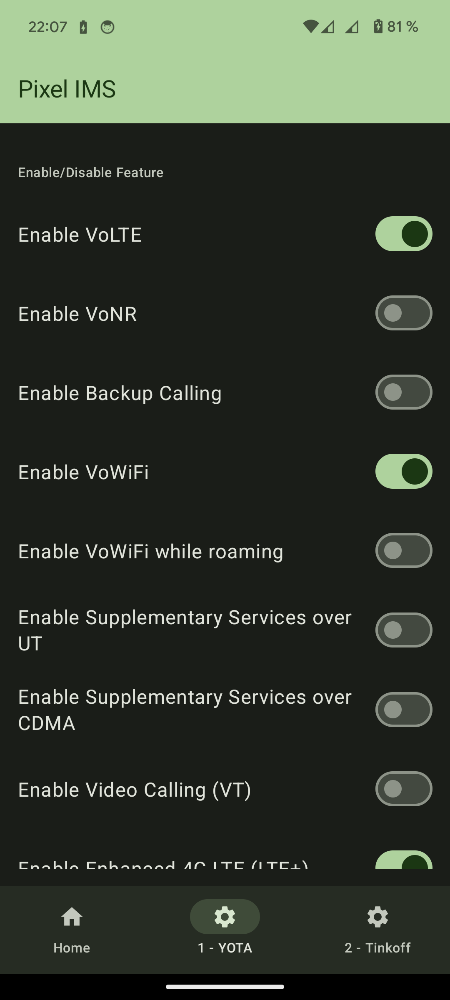
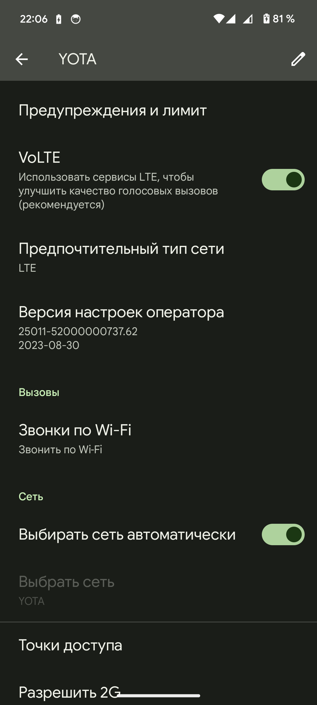

# Активация VoLTE и VoWiFi в Google Pixel

Начиная с Google Pixel 6, когда устройства стали производиться на базе собственных чипов Google Tensor, компания ограничила использование VoLTE (звонки через LTE) и VoWiFi (звонки через Wi-Fi) на территориях, где девайсы официально не продаются. Таким образом, пользователи Google Pixel 6 и новых моделей в России и стран СНГ вынуждены звонить через сети 3G с менее качественным звуком и без возможности параллельно пользоваться интернетом. До недавнего времени разблокировка VoLTE/VoWiFi производилась только с помощью root-прав и модулей Magisk, но теперь появился способ сделать это без разблокировки загрузчика.&#x20;

Для начала на компьютер необходимо установить ADB — что это и как пользоваться утилитой, можно найти в этой [инструкции](../adb.md). Ссылки на скачивание для разных платформ есть там же. На телефоне понадобится включить «Отладку по USB» в настройках «Для разработчиков».&#x20;

Чтобы воспользоваться ADB, нужно подключить телефон к компьютеру по проводу (можно и по Wi-Fi, но кабель надёжнее) и ввести в ADB следующую команду:

```bash
adb devices
```

На телефоне появится окно с разрешением на подключение — разрешаем.&#x20;

Для активации VoLTE на Google Pixel понадобится установить два приложения: Shizuku можно найти в [Google Play](https://play.google.com/store/apps/details?id=moe.shizuku.privileged.api) или на [GitHub](https://github.com/RikkaApps/Shizuku/releases), и Pixel IMS можно скачать с [GitHub](https://github.com/kyujin-cho/pixel-volte-patch/releases). Запустите приложение Shizuku и введите команду:

```bash
adb shell sh /sdcard/Android/data/moe.shizuku.privileged.api/start.sh
```

Если всё прошло успешно, в этом приложении вы увидите надпись «Shizuku запущен»

<figure><figcaption></figcaption></figure>

А в консоли отобразится следующий текст:

<figure><figcaption></figcaption></figure>

После этого откройте приложение Pixel IMS. Ему обязательно нужно дать доступ к Shizuku.

В нижней части экрана понадобится выбрать SIM-карту, если их несколько, и переключить тумблеры напротив пунктов Enable VoLTE и Enable VoWiFi.

<figure><figcaption></figcaption></figure>


Далее рекомендуется несколько раз перезагрузить устройство, но в моём случае всё заработало вообще без перезагрузок.&#x20;


Теперь нужно включить эти настройки внутри системы: «Настройки» → «Сеть и интернет» → «SIM-карты» → активная SIM-карта → пункты VoLTE и «Звонки по Wi-Fi». Тумблеры нужно переключить в положение «Включено».&#x20;

<figure><figcaption></figcaption></figure>

Проверить, всё ли получилось, можно двумя звонками. Если позвонить кому-либо при включённом LTE, статус сети сброситься не должен — так вы сможете пользоваться интернетом и параллельно звонить. Второй звонок нужен для тестирования VoWiFi — включайте «Режим полёта» и подключайтесь к Wi-Fi.&#x20;

При звонке и в истории вызовов около номера телефона высветится соответствующая иконка, и вызов пройдёт — значит, всё работает.


Внимание! После каждого обновления системы эти настройки будут сбрасываться и часть шагов придется повторять заново.

