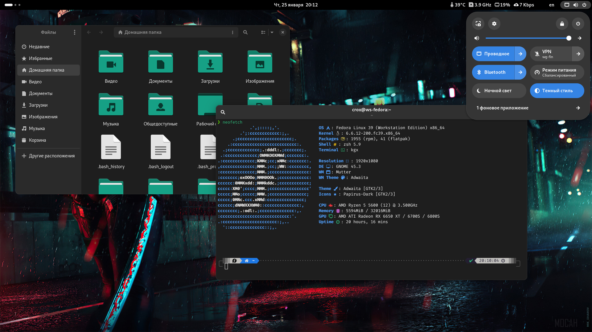

# Fedora

Fedora — это дистрибутив от RedHat, на котором они тестируют новые функции для того, чтобы потом внедрять их в свои коммерческие проекты. Но не смотря на это, на мой личный взгляд это один из лучших дистрибутивов, чтобы начать знакомство с Linux, да и в целом для повседневного использования. Да, это не самый легковесный дистрибутив, но он отлично дружит с новым железом, в качестве рабочего окружения имеет ванильный Gnome, файловую систему BTRFS, пакетный менеджер DNF, поддержку Flatpak из коробки и самое главное высокую стабильность. Использую я его в дуалбуте с Windows, так как периодически играю, а некоторые онлайн игры запустить на линуксе пока не представляется возможным, в частности из-за отсутствия поддержки анти-чита.

<div>

<figure><figcaption></figcaption></figure>

 

<figure><figcaption></figcaption></figure>

 

<figure><figcaption></figcaption></figure>

 

<figure><figcaption></figcaption></figure>

</div>

### Установка

Скачать дистрибутив можно на официальном сайте [Fedora](https://fedoraproject.org/). На данный момен самый актуальный дистрибутив Fedora Workstation 39. Чтобы записать его на флешку можно воспользоваться утилитой Rufus. В установке нет ничего сложного, Fedora имеет очень юзер френдли установщик Anaconda, на последнем этапе будет предложено выбрать разметку диска, рекомендую выбирать автоматическую. Если планируете установить его рядом в дуалбуте с Windows, рекомендую использовать для этого отдельный SSD диск. После установки дистрибутива обязательно выполняем обновление системы, команда Fedora Linux рекомендует это делать через официальный магазин приложений Gnome Software.

Но вы так же можете это сделать через терминал, следующими командами

```bash
sudo dnf update
```

```bash
sudo dnf upgrade --refresh
```

После этого перезагружаем систему и можем приступить к ее настройке, персонализации и установки софта. Об этом обязательно расскажу в других статьях.
