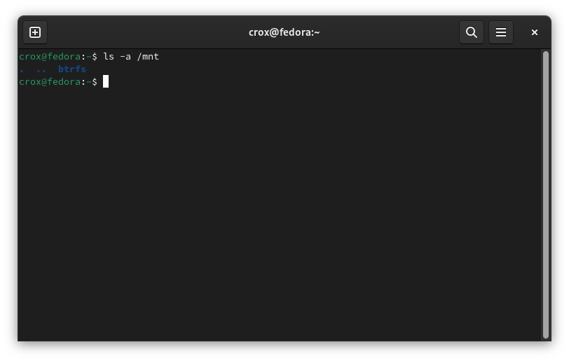
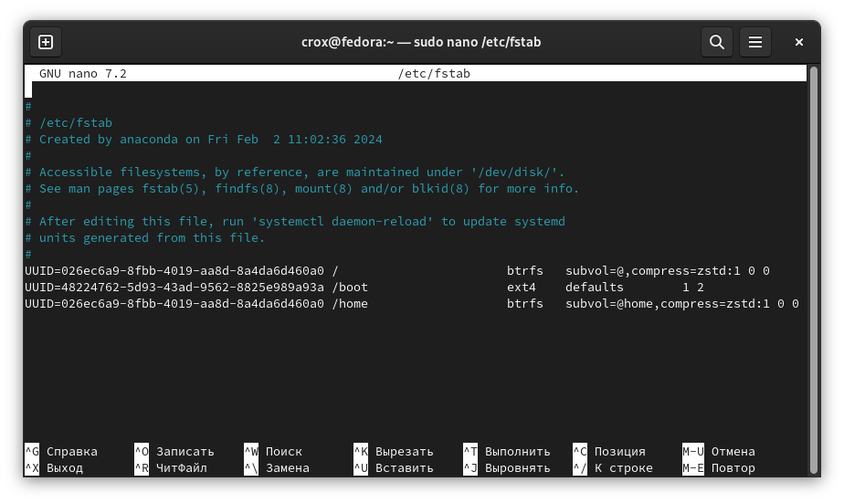
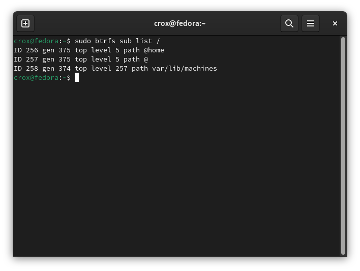
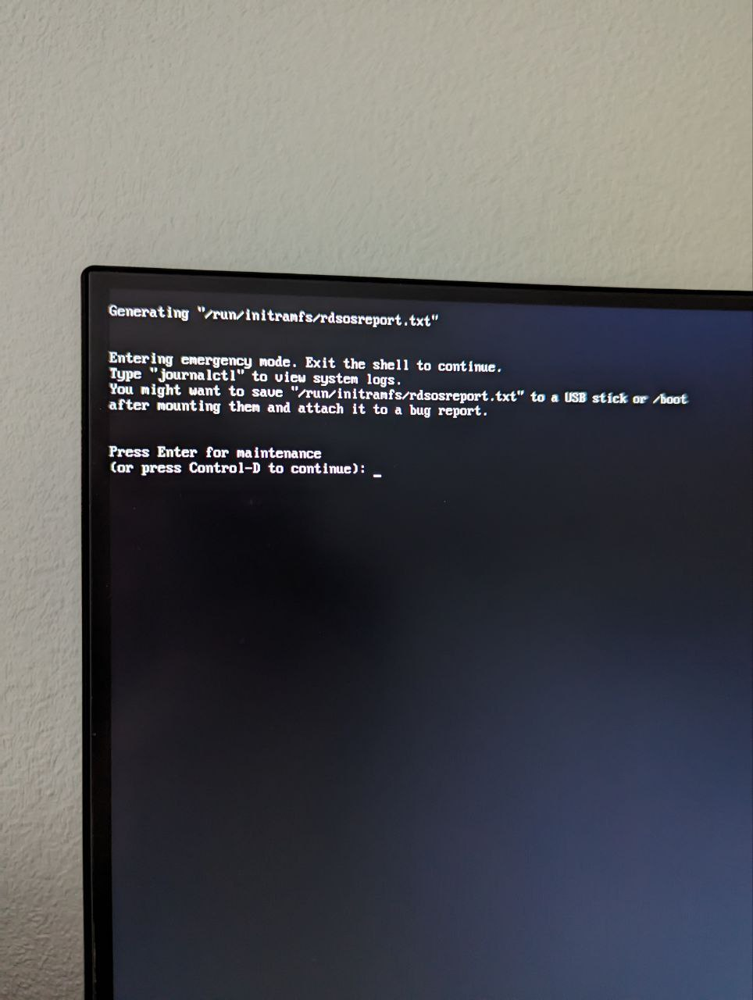
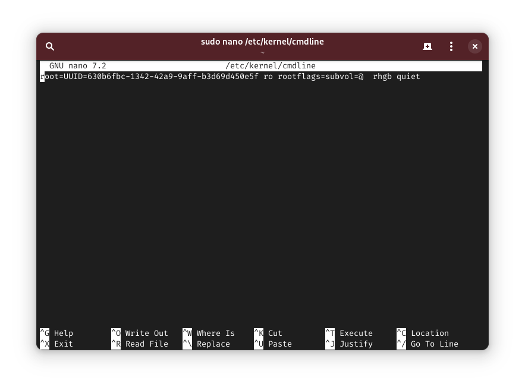

# Настраиваем BTRFS subvolumes

## Монтируем файловую систему


Для начала обязательно проверяем чтобы в нашей системе не было ничего примонтировано в директории `/mnt`


Проверить это можно командой

```bash
ls -a /mnt
```

Если видим, что в директории уже что-то примонтировано то можно создать в ней новую директорию например btrfs

```bash
sudo mkdir /mnt/btrfs
```

На скрине ниже видно что я ее уже создал

<figure><figcaption></figcaption></figure>

Дальше необходимо определить на какое устройство установлена система

```bash
df -h
```

<figure><figcaption></figcaption></figure>

Так как этот скриншот с виртуальной машины, видно что корневой раздел _/_ и _/home_ находятся на устройстве _/vda3_

Исходя из полученных результатов монтируем нашу файловую систему

```bash
sudo mount /dev/vda3 /mnt/btrfs
```


Если всё сделали правильно, то открыв примонтированую директорию через файловый менеджер, мы увидим примонтированные подразделы (subvolume) root и home.


## Перенос подразделов

Теперь перенесем наши подразделы

```bash
sudo mv /mnt/btrfs/root /mnt/btrfs/@
```

```bash
sudo mv /mnt/btrfs/home /mnt/btrfs/@home
```


Результат так же можно увидеть в файловом менеджере, вместо root и home должны появится @ и @home


## Вносим правки в fstab

```bash
sudo nano /etc/fstab
```


Меняем subvol=root нa @ , а subvol=/home на @home, должно получиться как на картинке ниже


<figure><figcaption></figcaption></figure>

Сохраняем Ctrl+S, выходим Ctrl+X

Обязательно обновляем Grub

```bash
sudo grub2-mkconfig -o /boot/efi/EFI/fedora/grub.cfg
```

или командой

```bash
sudo grub2-mkconfig -o /boot/grub2/grub.cfg
```

## Размонтируем файловую систему

Сбросим все данные с хэша в файловую систему:

```bash
sync
```

Размонтируем файловую систему:

```bash
sudo umount -r /mnt/btrfs
```


Перезагружаем ПК


Теперь можно посмотреть на наши подразделы

```bash
sudo btrfs sub list /
```

<figure><figcaption></figcaption></figure>


Внимание! У вас как и у меня после данных манипуляций может появиться проблема, когда система после обновления ядра не может загрузиться с новым ядром и в журнале вы видите ошибку: Failed to mount sysroot.mount - /sysroot. Как ее исправить я расскажу ниже.


<details>

<summary>Фото ошибок при загрузке ОС</summary>




</details>

Это возникает потому что в /etc/kernel/cmndline содержится старая информация о нашем корневом подразделе и файлы /boot/loader/entries/\*.conf не учитывают изменения, внесенные нами в /etc/fstab, соответственно правильные параметры ядра не передаются, а grub2-mkconfig перезаписывает неправильно файлы \*.conf

Решить эту проблему можно отредактировав файл /etc/kernel/cmdline

```bash
sudo nano /etc/kernel/cmdline
```


Меняем rootflags=subvol=root на rootflags=subvol=@, должно получиться как на картинке ниже


<figure><figcaption></figcaption></figure>

Сохраняем файл и обновляем Grub

```bash
sudo grub2-mkconfig -o /boot/efi/EFI/fedora/grub.cfg
```


Перезагружаем ПК. Проблема должна исчезнуть.

