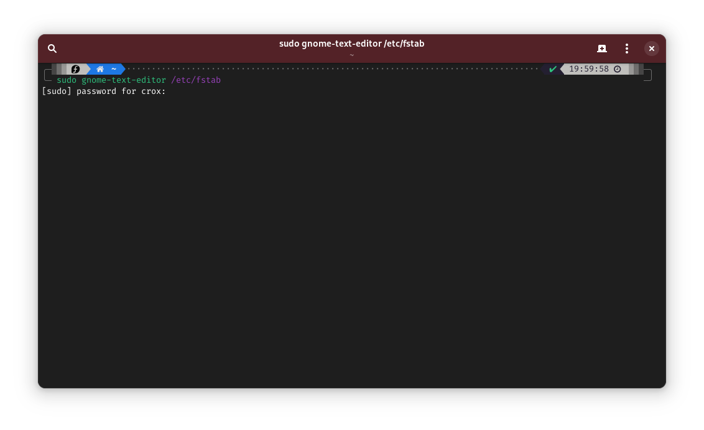

# Консоль Gnome

Gnome Console — это новый минималистичный эмулятор терминала для Gnome. Он не призван заменить классический терминал Gnome, а выступает просто альтернативой ему, если вам не нужно большое количество настрое которое имеет терминал. Например отсутствует возможность создания профилей. На скриншоте ниже представлены все настройки которые имеет консоль.

<figure><figcaption></figcaption></figure>

Как видите, изменить можно только шрифт. Но у консоль есть интересные визуальные эффекты, например когда вы хотите выполнить что-то от имени суперпользователя, то заголовок терминала загорится красным

<figure><figcaption></figcaption></figure>

А если у вас открыта SSH сессия в терминале, то заголовок будет фиолетовым, что бывает очень полезным, когда забываешь что-открыта ssh сессия и думаешь что работаешь со своим ПК

<figure><figcaption></figcaption></figure>

Чтобы установить консоль Gnome введите в терминале:

```bash
sudo dnf install gnome-console
```

Чтобы удалить терминал Gnome введите:

```bash
sudo dnf remove gnome-terminal
```

Чтобы в файловом менеджере появился пункт открыть в консоли, нужно закрыть его следующей командой:

```bash
nautilus --quit
```

Если вы используете горячие клавиши для открытия терминала, я к примеру использую Super(Windows)+T, то в поле команда нужно указать _kgx_ вместо _gnome-terminal_

### Если вам не понравилась Gnome консоль и вы хотите вернуть Gnome терминал, то следуйте инструкциям ниже

Установите Gnome Terminal

```bash
sudo dnf install gnome-terminal
sudo dnf install gnome-terminal-nautilus
```

Удалите Gnome Console

```bash
sudo dnf remove gnome-console
```

И выйдите из наутилуса чтобы появился пункт Открыть в терминале

```bash
nautilus --quit
```

В следующей статье расскажу как немного кастомизировать свой терминал.

