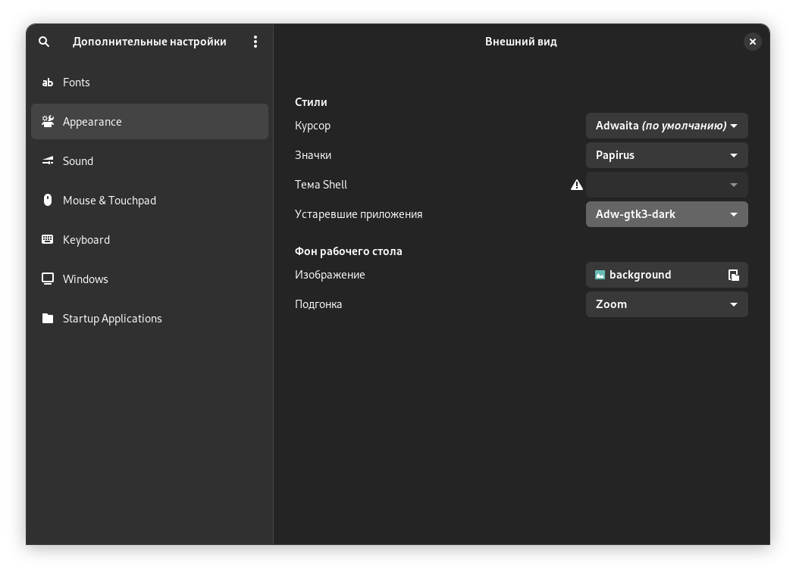

# Доп. настройки Gnome

Gnome Tweaks — утилита для тонкой настройки рабочей среды GNOME

Установить утилиту можно командой

```bash
dnf install gnome-tweaks
```

Это утилита позволяет управлять шрифтами, темами и многим другим. В ней вы можете например сменить иконки приложений, тему оформления, выбрать шрифт, добавить кнопки свернуть и развернуть в заголовок окна а так же переместить их на левую сторону.

Но с приходом GTK4 приложений, кастомизировать внешний вид системы, многи темы не работают корректно и не меняют внешний вид некоторых приложений. А главная проблема заключается в том, что начиная с 38 версии Fedora по умолчанию недоступна тема Adwaita для устаревших GTK3 приложений, а их остается не малое количество. Из-за чего такие приложения не будут следовать темному или светлому стилю системы, а так же могут некорректно отображаться, например вы можете не видеть некоторые элементы их интерфейса. Чтобы исправить эту проблему нужно установить тему Adwaita GTK3. Сделать это можно командой

```bash
dnf install adw-gtk3-theme
```

После чего зайдите в доп. настройки Gnome и вы увидите, что в списке тем для устаревших приложений появится две темы Adw-gtk-3 и Adw-gtk3-dark.

Так же если вы используете Flatpak приложения, то рекомендуется установить эту тему и для них

```bash
flatpak install org.gtk.Gtk3theme.adw-gtk3 org.gtk.Gtk3theme.adw-gtk3-dark
```

<figure><figcaption></figcaption></figure>

Выберите тему в соответствии со стилем вашей системы и ваши GTK3 приложения начнут отображаться корректно.


После установки Gnome Tweaks у вас автоматически включается сочетание клавиш Alt+Shift для переключения раскладки и может возникнуть проблема, что раскладка переключается не с первого раза. Нормального решения этой проблемы к сожалению я не нашел, кроме как отключить это сочетание клавиш. Для этого перейдите в раздел клавиатура и мышь->дополнительные параметры раскладки->переключение на другую раскладку->убрать галочку с alt+shift. В самой системе поменять сочетание клавиш для переключения раскладки к сожалению нельзя. Но сочетание клавиш Super(Win)+Пробел становится стандартом в Windows и давно используется в MacOS, поэтому пора привыкать.

