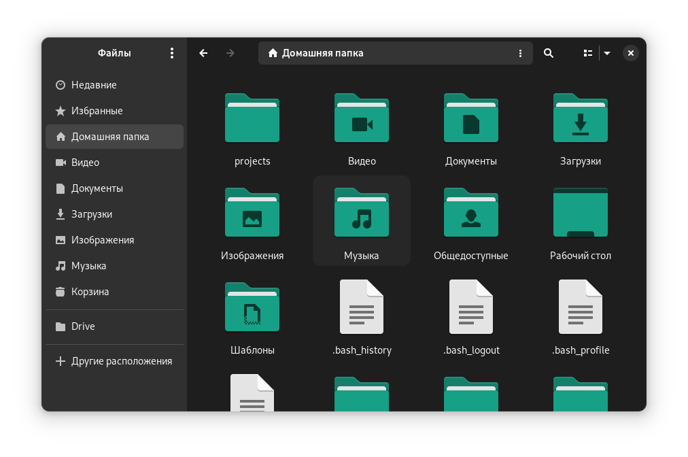

# Папки Papirus

<figure><figcaption></figcaption></figure>

## Скачиваем и устанавливаем

```bash
wget -qO- https://git.io/papirus-folders-install | sh
```

## Меняем стиль иконок выбрав нужное название из таблицы

Репозиторий на [Github](https://github.com/PapirusDevelopmentTeam/papirus-folders)

<table data-full-width="false"><thead><tr><th width="159">Name</th><th align="center">Preview</th><th width="144">Name</th><th align="center">Preview</th></tr></thead><tbody><tr><td><strong>adwaita</strong></td><td align="center">  </td><td><strong>black</strong></td><td align="center">  </td></tr><tr><td><strong>blue</strong></td><td align="center">  </td><td><strong>bluegrey</strong></td><td align="center">  </td></tr><tr><td><strong>breeze</strong></td><td align="center">  </td><td><strong>brown</strong></td><td align="center">  </td></tr><tr><td><strong>carmine</strong></td><td align="center">  </td><td><strong>cyan</strong></td><td align="center">  </td></tr><tr><td><strong>darkcyan</strong></td><td align="center">  </td><td><strong>deeporange</strong></td><td align="center">  </td></tr><tr><td><strong>green</strong></td><td align="center">  </td><td><strong>grey</strong></td><td align="center">  </td></tr><tr><td><strong>indigo</strong></td><td align="center">  </td><td><strong>magenta</strong></td><td align="center">  </td></tr><tr><td><strong>nordic</strong></td><td align="center">  </td><td><strong>orange</strong></td><td align="center">  </td></tr><tr><td><strong>palebrown</strong></td><td align="center">  </td><td><strong>paleorange</strong></td><td align="center">  </td></tr><tr><td><strong>pink</strong></td><td align="center">  </td><td><strong>red</strong></td><td align="center">  </td></tr><tr><td><strong>teal</strong></td><td align="center">  </td><td><strong>violet</strong></td><td align="center">  </td></tr><tr><td><strong>white</strong></td><td align="center">  </td><td><strong>yaru</strong></td><td align="center">  </td></tr><tr><td><strong>yellow</strong></td><td align="center">  </td><td></td><td align="center"></td></tr></tbody></table>

```bash
papirus-folders -C adwaita --theme Papirus-Dark
```


adwaita - это название стиля


## Узнать стиль установленный в системе на данный момент

```bash
papirus-folders -l --theme Papirus-Dark
```

## Вернуть стиль по умолчанию

```bash
papirus-folders -D --theme Papirus-Dark
```
