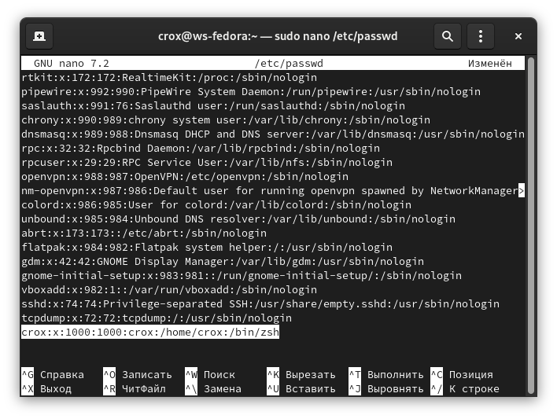
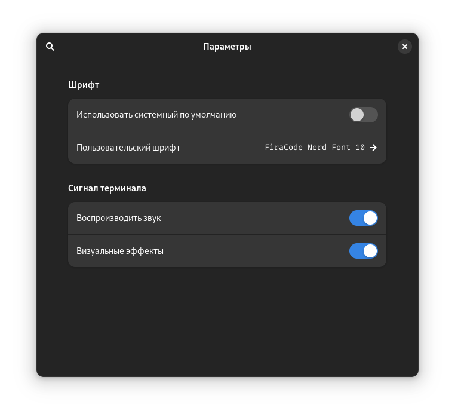

# Терминал на ZSH и Powerlevel10k

## **Что такое командная оболочка?**

Командная оболочка (**shell**) — это интерфейс, который обеспечивает доступ к командам и утилитам операционной системы. Она представляет собой командный интерпретатор, который позволяет пользователям вводить команды в терминал и получать ответы на них.

Командная оболочка позволяет пользователям запускать скрипты, автоматизировать задачи, управлять файлами и каталогами, работать с процессами и многое другое. Кроме того, она может быть настроена пользователем для удобства работы с операционной системой (зачем, собственно, мы здесь и собрались).

Существует множество различных командных оболочек для разных операционных систем. Некоторые из наиболее популярных командных оболочек в Unix‑подобных системах включают **Bash** (Bourne‑again shell), **Zsh** (Z shell). В Windows наиболее распространенной командной оболочкой является **cmd.exe**, а в более новых версиях Windows — **PowerShell**.

## Установка ZSH

### В дистрибутивах с пакетным менеджером DNF

```bash
sudo dnf install zsh
```

### В дистрибутивах с пакетным менеджером APT

```bash
sudo apt-get install zsh
```

## Скачиваем и устанавливаем шрифты FiraCode



Разархивируем и копируем в директорию /usr/share/fonts/

```bash
sudo mkdir -p /usr/share/fonts/FiraCode && sudo cp -r FiraCode /usr/share/fonts/
```

Обновляем кэш шрифтов

```bash
sudo fc-cache -v
```

## Делаем ZSH оболочкой по умолчанию для нашего терминала:

```
sudo nano /etc/passwd
```

и меняем /bin/bash на /bin/zsh:

<figure><figcaption></figcaption></figure>


Завершаем сеанс или перезагружаем систему


Выбираем шрифт в терминале

<figure><figcaption></figcaption></figure>

&#x20;Перезапускаем терминал, затем перезапускаем ZSH

```bash
exec zsh
```

## Скачиваем конфиг ZSH - .zshrc и копируем в папку /home

```bash
git clone https://github.com/metgen/conffiles.git
```

Устанавливаем все плагины (zplug)

```bash
zsh
```

## Запускаем мастер настройки темы [Powerlevel10k](https://github.com/romkatv/powerlevel10k)

```bash
p10k configure
```
