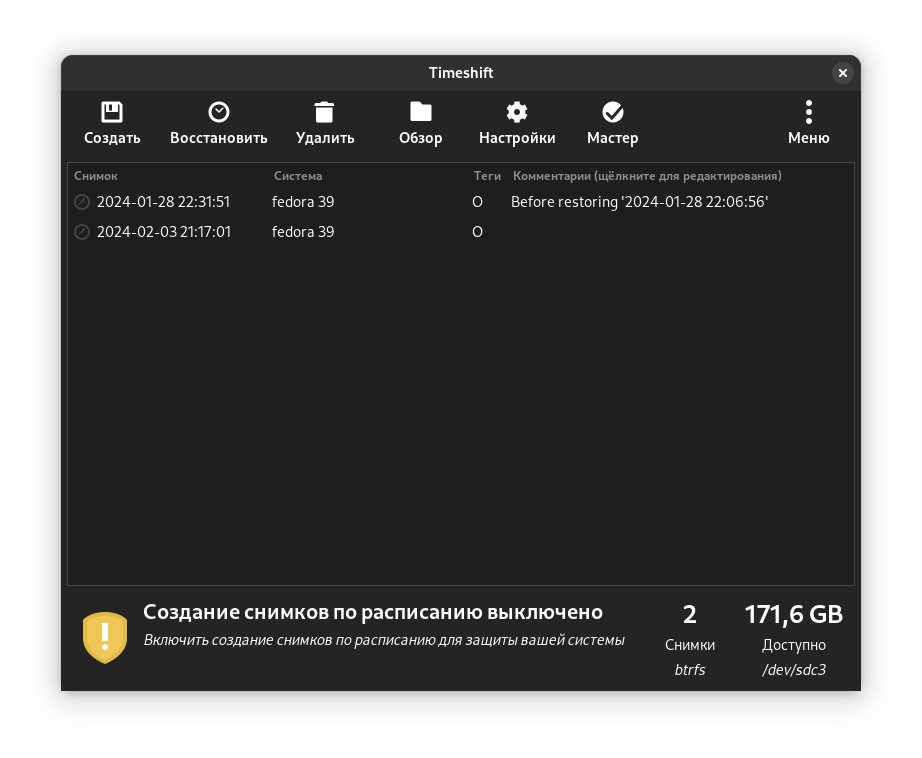

# 💾 Бэкап

## Timeshift

<figure><figcaption></figcaption></figure>

Timeshift — это приложение, которое обеспечивает функциональность, аналогичную функции _восстановления системы_ в Windows и инструменту _Time Machine_ в Mac OS. Timeshift защищает вашу систему, делая инкрементальные снимки файловой системы через регулярные промежутки времени. Эти снимки можно восстановить позже, чтобы отменить все изменения в системе.

В режиме RSYNC снимки создаются с использованием [rsync](http://rsync.samba.org/) и [жестких ссылок](http://en.wikipedia.org/wiki/Hard\_link). Общие файлы распределяются между снимками, что экономит дисковое пространство. Каждый снимок представляет собой полную резервную копию системы, которую можно просмотреть с помощью файлового менеджера.

В режиме BTRFS снимки создаются с использованием встроенных функций файловой системы BTRFS. Снимки BTRFS поддерживаются только в системах BTRFS, имеющих макет подтома типа Ubuntu (с подтомами @ и @home).

Timeshift похож на такие приложения, как [rsnapshot](http://www.rsnapshot.org/), [BackInTime](https://github.com/bit-team/backintime) и [TimeVault](https://wiki.ubuntu.com/TimeVault), но преследует другие цели. Он предназначен для защиты только системных файлов и настроек. Пользовательские файлы, такие как документы, изображения и музыка, исключаются. Это гарантирует, что ваши файлы останутся неизменными при восстановлении системы на более раннюю дату. Если вам нужен инструмент для резервного копирования ваших документов и файлов, обратите внимание на [Baqpaq](https://teejeetech.com/product/baqpaq/) , который более настраиваемый и предоставляет возможности для сохранения пользовательских файлов.

### Снимки Rsync и BTRFS

* Поддерживает снимки rsync во всех системах.
* Поддерживает снимки BTRFS в системах BTRFS.

Настоятельно рекомендуется использовать снимки BTRFS в системах, установленных в разделе BTRFS. Снимки BTRFS представляют собой идеальные побайтовые копии системы. Ничего не исключено. Снимки BTRFS можно создавать и восстанавливать за считанные секунды, при этом они занимают очень мало места на диске.

#### Пользовательские данные исключены по умолчанию

Timeshift предназначен для защиты системных файлов и настроек. Это НЕ инструмент резервного копирования и не предназначен для защиты пользовательских данных. По умолчанию все содержимое домашних каталогов пользователей исключается. Это имеет два преимущества:

* Вам не нужно беспокоиться о том, что ваши документы будут перезаписаны при восстановлении предыдущего снимка для восстановления системы.
* Ваша коллекция музыки и видео в домашнем каталоге не будет занимать место на устройстве резервного копирования.

Вы можете выборочно включать элементы для резервного копирования в  окне _**«Настройки»**_  . Выбор опции « _Включить скрытые элементы_ » на  вкладке _**«Пользователи**_  » приведет к резервному копированию и восстановлению скрытых файлов и каталогов в вашей домашней папке. Эти папки содержат файлы конфигурации для конкретного пользователя и при необходимости могут быть включены в снимки.

_Примечание. Не рекомендуется включать пользовательские данные в резервные копии, поскольку они будут перезаписаны при восстановлении снимка._

### Поддерживаемые конфигурации системы

* **Нормальный**  — ОС установлена ​​на незашифрованных разделах.
* **LUKS Encrypted**  – ОС установлена ​​на разделах, зашифрованных LUKS.
* **LVM2**  – ОС, установленная на томах LVM2 (с LUKS или без него)
* **BTRFS**  — ОС, установленная на томах BTRFS (с LUKS или без него).
  * Поддерживаются только макеты типа Ubuntu с подтомами **@** и **@home.**
  * **Подтома @** и **@home** могут находиться на одном или разных томах BTRFS.
  * **@** может находиться на томе BTRFS, а **/home** может быть смонтирован на разделе, отличном от BTRFS.
  * Другие макеты не поддерживаются
* **GRUB2**  – загрузчик должен быть GRUB2. Устаревшие GRUB и другие загрузчики не поддерживаются.
* **EFI**  – поддерживаются системы EFI. Перед восстановлением снимков убедитесь, что  `/boot/efi` раздел выбран для монтирования (приложение сделает это автоматически).
* **Зашифрованный раздел home**. Для пользователей с зашифрованным home файлы  `/home/.ecryptfs/$USER` будут скопированы и восстановлены. Расшифрованное содержимое  `$HOME` будет исключено. Это позволяет избежать риска безопасности, связанного с тем, что расшифрованное содержимое становится доступным за пределами домашнего каталога пользователя.
* **Зашифрованный личный каталог**  . Для пользователей с зашифрованным  _личным_  каталогом зашифрованные файлы в  `$HOME/.Private`, а также расшифрованные файлы в  `$HOME/Private`, будут исключены (поскольку они содержат пользовательские данные). Фильтры, добавленные пользователем для включения файлов из  `$HOME/.Private` или,  `$HOME/Private` будут игнорироваться.
* **Docker и контейнеры**  — Docker и контейнерные системы не поддерживаются. Запуск Timeshift на таких системах приведет к непредсказуемым результатам.

### Установка

#### В дистрибутивах с пакетным менеджером DNF

```bash
sudo dnf install timeshift
```


Если вы хотите установить Timeshift в Fedora Linux то для начала нужно перейти к гайду [nastroika-btrfs-subvolumes.md](../gaidy/prochee/nastroika-btrfs-subvolumes.md "mention")так как приложение создавалась под deb-подобные дистрибутивы и не понимает маркировку subvolumes в Fedora Linux.


#### В дистрибутивах с пакетным менеджером APT

```bash
sudo apt-get install timeshift
```
