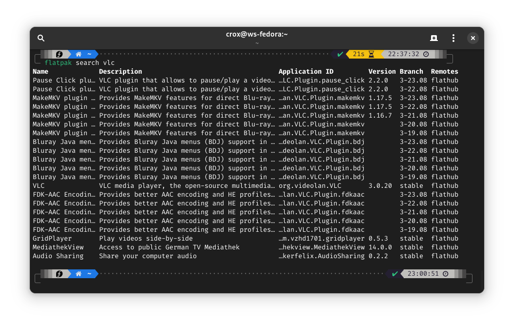
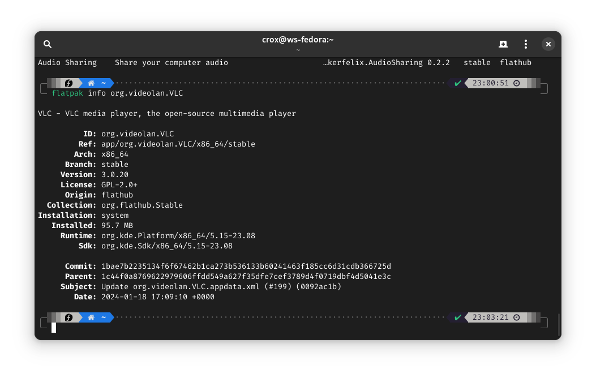

# 📦 Flatpak

## Flatpak

[Flatpak](https://flatpak.org/) - это независимый от дистрибутива метод упаковки и распространения программного обеспечения Linux.

Использование программного обеспечения, распространяемого с помощью Flatpak, имеет несколько неоспоримых преимуществ:

* Программное обеспечение, не совместимое с текущими системными библиотеками, будет работать, если оно упаковано как Flatpak
* Дельта-обновления делают обновления более эффективными для сети в долгосрочной перспективе

Есть и другие соображения, на которые следует обратить внимание:

* Флэтпаки не обновляются в рамках обновлений системы - их нужно обновлять отдельно
* Только темы, которые были перенесены на Flatpak, будут работать с флетпаками
* Для использования Flatpaks необходимо установить большой набор общих исполнительных программ

### Управление флэтпаками через CLI

#### **Поиск и установка флэтпаков**

Вы можете использовать команду `flatpak search` для поиска доступных пакетов. Например, если вы хотите установить VLC - вот как это может выглядеть:

```bash
flatpak search vlc
```

<figure><figcaption></figcaption></figure>

Из этого вывода мы можем увидеть VLC и некоторые связанные с ним приложения через Flatpak. Чтобы установить VLC, мы используем его "Application ID", показанный выше, с помощью команды:

```bash
flatpak install org.videolan.VLC
```

**Отображение подробной информации о Flatpak**

Вы можете получить более подробную информацию о конкретном Flatpak с помощью команды `flatpak info`. Например:

```bash
flatpak info org.videolan.VLC
```

<figure><figcaption></figcaption></figure>

#### **Получение списка установленных флэтпаков**

Чтобы показать список всех установленных в данный момент флэтпаков и времени выполнения, можно воспользоваться командой:

```bash
flatpak list
```

#### **Обновление флетпаков**

Обновление вашего набора флэтпаков - это простой процесс. Просто выполните команду:

```bash
flatpak upgrade
```

#### **Удаление флетпаков**

Вы можете удалить флэтпак с помощью команды `flatpak uninstall`. Например:

```bash
flatpak uninstall org.videolan.VLC
```

Удалить неиспользуемые библиотеки:

```bash
flatpak remove --unused
```

Удаление папки и конфигов с каталога `/var`

```bash
flatpak remove --delete-data
```

## Flathub

[Flathub](https://flathub.org/) — это сервис сборки и распространения приложений Flatpak. Его цель — выступать в качестве центрального узла для предоставления пользователям доступа к настольным приложениям.

## Flatseal

Flatseal — это графическая утилита для просмотра и изменения разрешений ваших приложений [Flatpak](https://flatpak.org/) .

### Установка

```bash
flatpak install flathub com.github.tchx84.Flatseal
```
