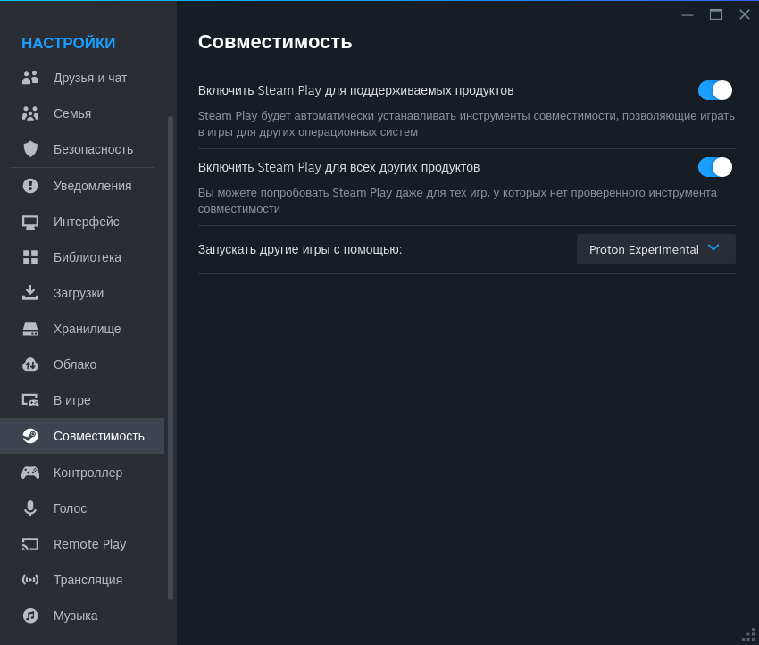
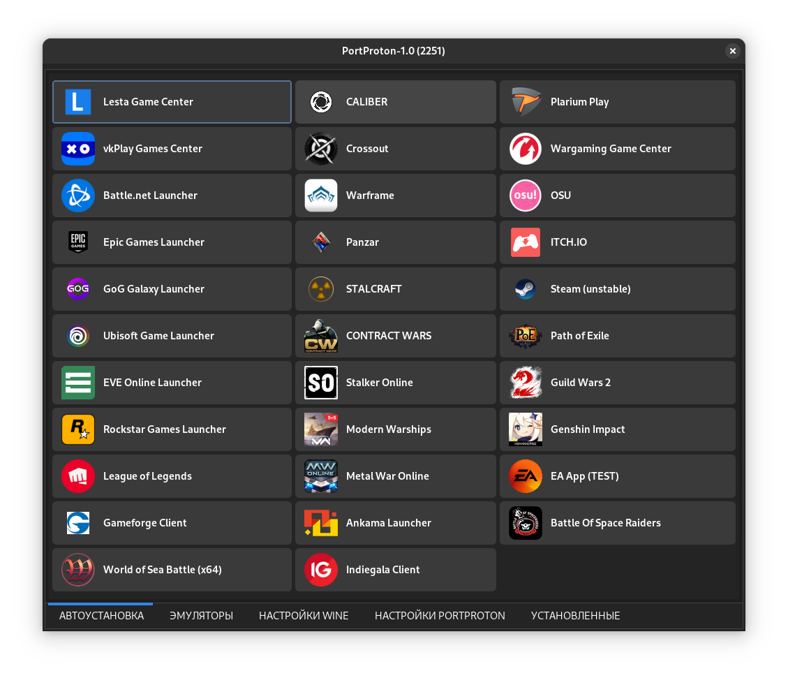
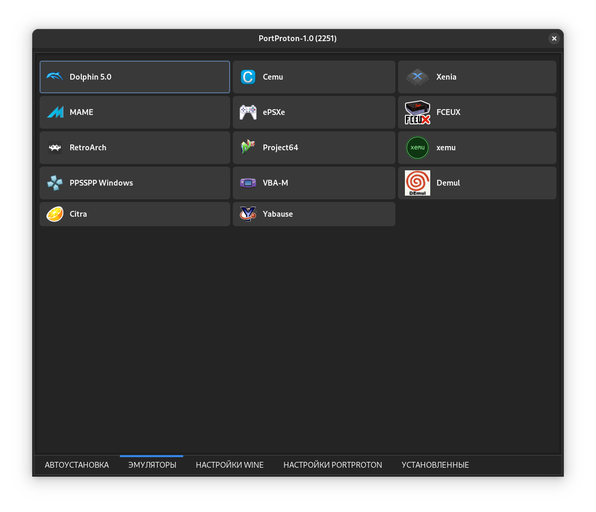

# 🎮 Игры

## Steam

### Установка

```bash
flatpak install flathub com.valvesoftware.Steam
```

### Включаем Proton (Steam Play) для запуска игр на линуксе

<figure><figcaption></figcaption></figure>

## PortProtom

Большинство популярных видеоигр, созданных для Windows, легко и удобно запускать на компьютерах с операционными системами «Альт». Это возможно благодаря приложению [PortProton](https://linux-gaming.ru/2022/11/24/portproton/), которое разработал и успешно развивает программист «[Базальт СПО](https://www.basealt.ru/)».

_«PortProton сделал доступными большинство современных игр для пользователей ОС «Альт» и других ОС на ядре Linux,_ — рассказал разработчик проекта PortProton Михаил Тергоев. — _Приложение создает и автоматически настраивает префикс — каталог, в котором имитируется рабочая среда Windows и запускаются видеоигры. Список установки содержит такие популярные онлайн-игры, как «Мир танков», «Мир кораблей», League of Legends, Genshin Impact. Вручную можно инсталлировать игры, не входящие в список, например, Starfield, Baldur's Gate 3, Resident Evil 4, Cyberpunk2077 и другие высокобюджетные проекты»._

**PortProton** основан на версии WINE от Valve (Proton) и ее модификациях (Proton GE). Включает в себя набор скриптов в сочетании с самим WINE-PROTON, контейнером Steam Runtime Sniper с добавлением портированных версий MANGOHUD (вывод полезной информации через окно игры: FPS, FrameTime, CPU, GPU и т.д.) и vkBasalt (улучшение графики в играх, очень хорошо в сочетании с FSR, DLSS) + множество уже настроенных оптимизаций для максимальной производительности.

Популярные игровые лаунчеры собраны на вкладке «Автоустановка», их можно установить «в один клик».

Установить и настроить PortProton значительно проще, чем большинство приложений со сходными функциями, работающих с wine. С этим справится даже начинающий пользователь, ознакомившись с [инструкцией по установке](https://linux-gaming.ru/2022/11/24/portproton/) на сайте сообщества.

Отличительная черта PortProton — удобный графический интерфейс с обширным списком настроек для продвинутого пользователя. Разобраться в нем очень просто благодаря всплывающим подсказкам на русском языке.

Если вопросы всё же возникнут, члены сообщества, которых на сегодня более 4 тыс., подскажут и помогут.

На мощных игровых компьютерах PortProton позволяет улучшить качество графики в играх почти без потери производительности. Хотя приложение ориентировано на игры, с его помощью можно запускать и другие программы.

### Установка

#### Включаем Non-free репозиторий:

```bash
sudo dnf install https://download1.rpmfusion.org/nonfree/fedora/rpmfusion-nonfree-release-$(rpm -E %fedora).noarch.rpm
```

#### Устанавливаем зависимости:

```bash
sudo dnf update && sudo dnf upgrade --refresh && sudo dnf install curl gamemode icoutils libcurl wget zenity bubblewrap zstd cabextract tar goverlay openssl
```

#### Стандартная установка:

```bash
wget -c "https://github.com/Castro-Fidel/PortWINE/raw/master/portwine_install_script/PortProton_1.0" && sh PortProton_1.0
```

#### Тихая установка (RUS):

```bash
wget -c "https://github.com/Castro-Fidel/PortWINE/raw/master/portwine_install_script/PortProton_1.0" && sh PortProton_1.0 -rus
```

#### Тихая установка (ENG):

```bash
wget -c "https://github.com/Castro-Fidel/PortWINE/raw/master/portwine_install_script/PortProton_1.0" && sh PortProton_1.0 -eng
```

<figure><figcaption><p>PortProton - лаунчеры</p></figcaption></figure>

<figure><figcaption><p>PortProton - эмуляторы</p></figcaption></figure>
