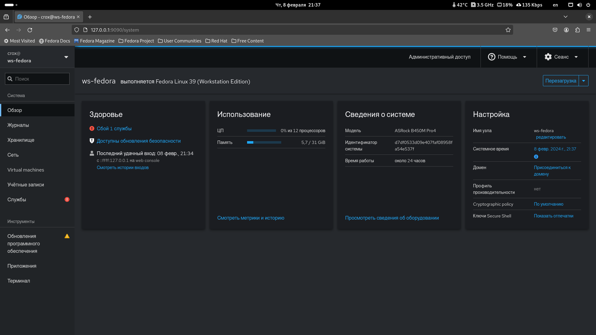

# Cockpit

Как установить Cockpit в Fedora

1.  Установить Cockpit:

    ```bash
    sudo dnf install cockpit
    ```
2.  Включить Cockpit:

    ```bash
    sudo systemctl enable --now cockpit.socket
    ```
3.  При необходимости откройте брандмауэр:

    ```bash
    sudo firewall-cmd --add-service=cockpit
    sudo firewall-cmd --add-service=cockpit --permanent
    ```

После этого перейдите по адресу [http://127.0.0.1:9090](http://127.0.0.1:9090/system) и зайдите под своей учетной записью

<figure><figcaption></figcaption></figure>
