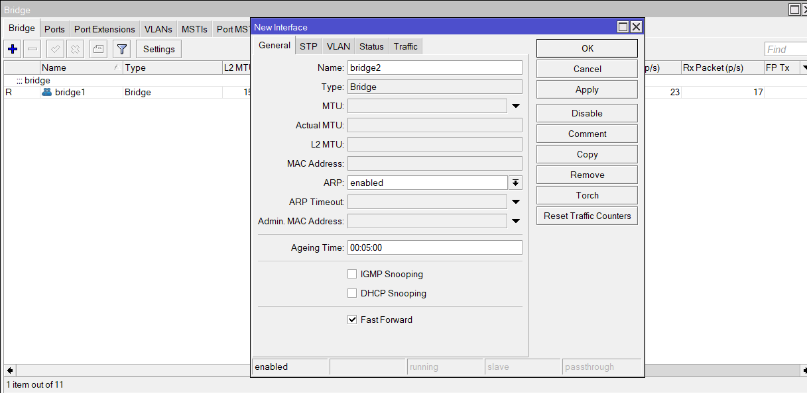

# Базовая настройка

### WinBox

WinBox – это приложение для управления устройствами на базе Mikrotik RouterOS, использующее легкий для системы и простой для пользователя интерфейс. WinBox выпускается только для Windows, но также возможен запуск утилиты с помощью эмуляторов под Linux или MacOS.  Скачать утилиту можно c [официального сайта](https://mikrotik.com/download).

### Подключение к роутеру

Запускаем утилиту WinBox и подключаемся к роутеру. Можно указать ip адрес вручную, а также найти его во вкладке **Neighbors.** Дефолтный адрес роутера 192.168.88.1, логин - admin, а пароль - пустой.

При первоначальной настройки рекомендуется сбросить настройки. Для этого надо в терминале набрать сначала **system**, а затем **reset**. У вас спросят подтверждение и после этого routerboard перезагрузится с заводскими настройками.

### Обновление прошивки

Переходим в **System -> Packages** и нажимаем кнопку **Check for Updates**. Если нашлось обновление, нажимаем **Download\&Install**. После этого необходимо перезагрузиться **System -> Reboot.**

<figure><figcaption></figcaption></figure>

После перезагрузки снова подключаемся к роутеру, заходим в **System -> RoutrBOARD,** проверяем строки _Current Firmware_ и _Upgrade Firmware_. Если они отличаются, то жмете кнопку **Upgrade**. Если одинаковые, то можно ничего не делать. Изменения вступят в силу после перезагрузки.

### Объединение портов в бридж

Одной из особенностей роутеров mikrotik является отсутствие предустановленных настроек для портов.  Покупая обычный бюджетный роутер, вы увидите подписи к портам. На одном из них обязательно будет написано WAN, на других либо ничего не будет написано, либо LAN. То есть у вас уже будет один порт настроен определенным образом для подключения интернета и остальные порты будут объединены в switch для удобства подключения оборудования.

В Mikrotik не так. Там все порты равнозначны и WAN портом может стать абсолютно любой, какой пожелаете. Я использую для подключения WAN - 1 порт, а все остальные объединю в единую сеть с помощью bridge и добавлю к ним wifi интерфейсы. Для этого идем в раздел **Bridge** и создаем новый bridge1

<figure><figcaption></figcaption></figure>

После этого переходим во вкладку Ports и добавляем нужны нам интерфейсы в bridge1

<figure><figcaption></figcaption></figure>

### Настройка статического IP адреса роутера

Для этого идем в раздел **IP -> Addresses** и жмем плюсик.

<figure><figcaption></figcaption></figure>

Указываем в разделе Address подсеть которую вы планируете использовать. Я выбрал 192.168.78.0/24, адрес роутера 192.168.78.254, в качестве интерфейса выбираем созданный ранее bridge1. Поле Network можно не заполнять, оно заполнится автоматически. Теперь наш роутер доступен и по локальным интерфейсам, и по wifi (который еще предстоит настроить) по адресу 192.168.78.254.

### Подключение интернета

В зависимости от провайдера могут быть разные варианты подключения.

1. Статическая конфигурация - провайдер предоставляет вам готовые настройки и вы вводите их вручную.
2. Динамическая - вы получаете настройки по DHCP/
3. PPPOE - нужно получить логин и пароль провайдера.

Рассмотрим для начала первый вариант.&#x20;
