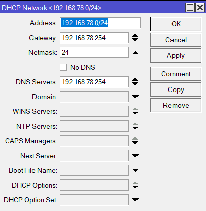

# Базовая настройка

### WinBox

WinBox – это приложение для управления устройствами на базе Mikrotik RouterOS, использующее легкий для системы и простой для пользователя интерфейс. WinBox выпускается только для Windows, но также возможен запуск утилиты с помощью эмуляторов под Linux или MacOS.  Скачать утилиту можно c [официального сайта](https://mikrotik.com/download).

### Подключение к роутеру

Запускаем утилиту WinBox и подключаемся к роутеру. Можно указать ip адрес вручную, а также найти его во вкладке **Neighbors.** Дефолтный адрес роутера 192.168.88.1, логин - admin, а пароль - пустой.

При первоначальной настройки рекомендуется сбросить настройки. Для этого надо в терминале набрать сначала **system**, а затем **reset**. У вас спросят подтверждение и после этого routerboard перезагрузится с заводскими настройками.

### Обновление прошивки

Переходим в **System -> Packages** и нажимаем кнопку **Check for Updates**. Если нашлось обновление, нажимаем **Download\&Install**. После этого необходимо перезагрузиться **System -> Reboot.**

<figure><figcaption></figcaption></figure>

После перезагрузки снова подключаемся к роутеру, заходим в **System -> RoutrBOARD,** проверяем строки _Current Firmware_ и _Upgrade Firmware_. Если они отличаются, то жмете кнопку **Upgrade**. Если одинаковые, то можно ничего не делать. Изменения вступят в силу после перезагрузки.

### Объединение портов в бридж

Одной из особенностей роутеров mikrotik является отсутствие предустановленных настроек для портов.  Покупая обычный бюджетный роутер, вы увидите подписи к портам. На одном из них обязательно будет написано WAN, на других либо ничего не будет написано, либо LAN. То есть у вас уже будет один порт настроен определенным образом для подключения интернета и остальные порты будут объединены в switch для удобства подключения оборудования.

В Mikrotik не так. Там все порты равнозначны и WAN портом может стать абсолютно любой, какой пожелаете. Я использую для подключения WAN - 1 порт, а все остальные объединю в единую сеть с помощью bridge и добавлю к ним wifi интерфейсы. Для этого идем в раздел **Bridge** и создаем новый bridge1

<figure><figcaption></figcaption></figure>

После этого переходим во вкладку Ports и добавляем нужны нам интерфейсы в bridge1

<figure><figcaption></figcaption></figure>

### Настройка статического IP адреса роутера

Для этого идем в раздел **IP -> Addresses** и жмем плюсик.

<figure><figcaption></figcaption></figure>

Указываем в разделе Address подсеть которую вы планируете использовать. Я выбрал 192.168.78.0/24, адрес роутера 192.168.78.254, в качестве интерфейса выбираем созданный ранее bridge1. Поле Network можно не заполнять, оно заполнится автоматически. Теперь наш роутер доступен и по локальным интерфейсам, и по wifi (который еще предстоит настроить) по адресу 192.168.78.254.

### Подключение интернета

В зависимости от провайдера могут быть разные варианты подключения.

1. Статическая конфигурация - провайдер предоставляет вам готовые настройки и вы вводите их вручную.
2. Динамическая - вы получаете настройки по DHCP/
3. PPPOE - нужно получить логин и пароль провайдера.

Рассмотрим для начала первый вариант.  Для этого снова переходим в раздел **IP -> Addresses** и жмем плюсик. Вводим адрес, маску и шлюз, которые вам предоставил провайдер, выбираем интерфейс к которому подключен провод провайдера, в данном случае это ether1.

Далее необходимо настроить шлюз по-умолчанию. Без этого обязательного шага интернет не заработает. Идем в раздел **IP -> Routes** и жмем плюсик для добавления шлюза по-умолчанию. В _Dst. Address_ оставляем как есть _0.0.0.0/0_, а в поле _Gateway_ вписываем шлюз провайдера и жмем ОК.

<figure><figcaption></figcaption></figure>

На этом моменте по идее должен появиться интернет. но без указания DNS сервера ображаться можно только по прямым адресам. Можно открыть терминал и пропинговать DNS сервер Google - 8.8.8.8

Теперь настроим DNS сервер. Для этого идем в **IP -> DNS**, в поле _Servers_ вводим адрес dns сервера провайдера. Если у вас их два, то нажав на треугольничек, направленной вершиной вниз, вы можете ввести еще одно значение. Обязательно ставите галочку напротив _Allow Remote Requests_.

<figure><figcaption></figcaption></figure>

Если у вас внешний IP адрес и вы разрешили удаленные DNS запросы, обязательно выполните настройку firewall и заблокируйте все входящие соединения. Если этого не сделать, то ваш роутер может стать жертвой поддельных dns запросов, которые используют для ddos атак.

Теперь, мы полностью установили настройки интернета провайдера. Можно проверить и пропинговать привычный адрес сайта, например ya.ru

На самом маршрутизаторе уже есть выход в интернет, но нам нужно его настроить для пользователей. Для этого продолжаем настройку mikrotik.

### Настройка dhcp сервера

Для того, чтобы подключенные устройства могли получать сетевые настройки автоматически с роутера, на нем необходимо настроить DHCP сервер. Сначала идем в **IP -> Pool** нажимаем плюсик и задаем пул адресов которые мы хотим использовать для DHCP сервера, в моем случае это 192.168.78.1-192.168.78.253, так как последний доступный адрес из этой подсети занят маршрутизатором.

<figure><figcaption></figcaption></figure>

Далее переходим в **IP -> DHCP Server**, переходим на вкладку DHCP и нажимаем плюсик. Нам предлагают выбрать интерфейс, на котором будет работать сервер. Выбираем _bridge1_ и пул адресов выбираем dhcp\_pool1.

<figure><figcaption></figcaption></figure>

После этого переходим во вкладку Network и нажимаем плюс, указываем адрес нашей подсети, шлюз, маску и DNS сервер. В данном случае сам маршрутизатор указан в качестве DNS сервера. При желании можно указать любые адреса DNS серверов на ваш вкус, но перед этим надо снять галочку Allow Remote Request в настройках DNS сервера и клиенты по DHCP начнут получать указанные вами DNS адреса.

<figure><figcaption></figcaption></figure>

Если сейчас подключить любого клиента по проводу то он получит сетевые настройки, но в интернет выйти не сможет, т.к. мы еще не настроили NAT.

### Настройка NAT

Идем в раздел **IP -> Firewall**, открываем вкладку NAT и жмем плюсик. На вкладке General указываем только один параметр _Out. Interface - ether1_ (интерфейс подключения к провайдеру), все остальное не трогаем.

<figure><figcaption></figcaption></figure>

Переходим на вкладку Action, выбираем в выпадающем списке _masquerade_. Остальное не трогаем и жмем ОК.

<figure><figcaption></figcaption></figure>

Настройка NAT завершена, теперь клиенты которые подключились по проводу смогут получить доступ в интернет. Осталось настроить Wi-Fi.

### Настройка точки доступа Wi-Fi

Настройка wi-fi в микротике имеет очень много нюансов и возможностей. Мы сделаем самую простую настройку, которая подойдет и полностью удовлетворит потребности домашнего wi-fi роутера. А для более тонких настроек можно будет воспользоваться отдельным материалом на эту тему.

Сначала активируем беспроводные интерфейсы. По-умолчанию они выключены. Идем в раздел **Wireless**, выбираем wlan1, wlan2 и жмем синюю галочку.

_wlan1 - Wi-Fi 2.4_

_wlan2 - Wi-Fi 5_

<figure><figcaption></figcaption></figure>

Переходим на вкладку Security profiles, два раза жмем мышкой на строчку с профилем default. В поле _Mode_ выбираем _dynamic keys_. Ставим галочки напротив _WPA2 PSK_ и _aes ccm_. В поля _WPA Pre-Shared Key_ и _WPA2 Pre-Shares Key_ вводим пароль от будущей беспроводной сети.&#x20;

<figure><figcaption></figcaption></figure>

Сохраняем настройки. Возвращаемся на вкладку **Interfaces** и два раза жмем на wlan1 ,открываются настройки wifi интерфейса микротика. Переходим на вкладку Wireless и выставляем настройки.

<figure><figcaption></figcaption></figure>

Далее так же настраиваем wlan2

<figure><figcaption></figcaption></figure>

* **SSID** - имя вашей беспроводной сети. Пишите то, что хочется.

Сохраните настройки, нажав ОК. Теперь подключитесь к Wi-Fi и проверьте доступ в интернет.


Статья будет дополняться

