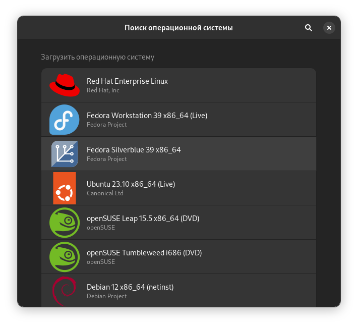

# Gnome Boxes

GNOME Boxes — это приложение среды рабочего стола GNOME, используемое для доступа к виртуальным системам. Boxes использует технологии виртуализации QEMU , KVM и libvirt.

Для GNOME Boxes требуется, чтобы процессор поддерживал некоторую форму аппаратной виртуализации (например, AMD-V или Intel VT-x ).

<figure><figcaption></figcaption></figure>

Приложение имеет максимально простой интуитивно понятный интерфейс, но имеет минимально количество настроек.&#x20;
