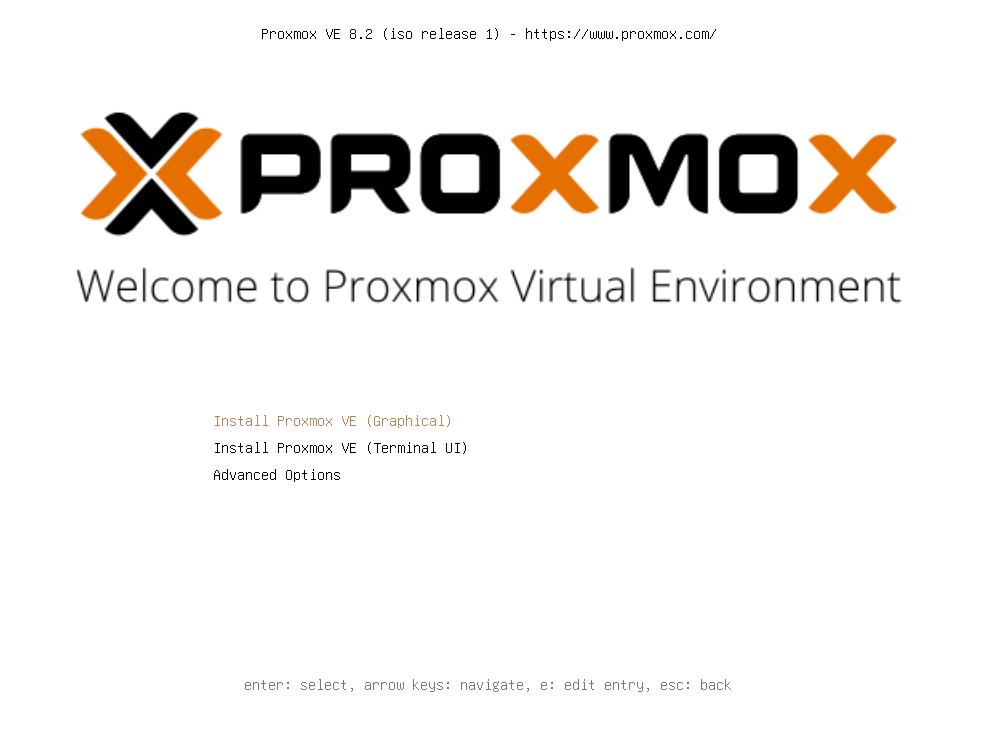
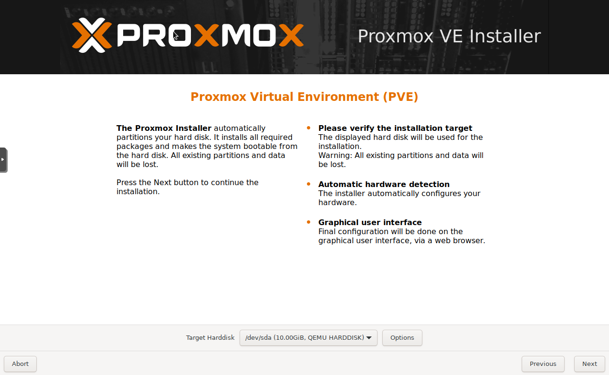
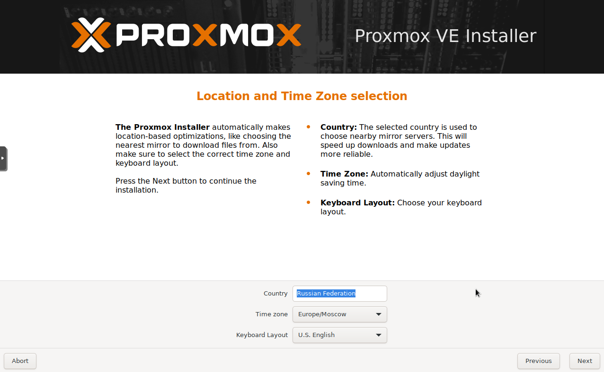
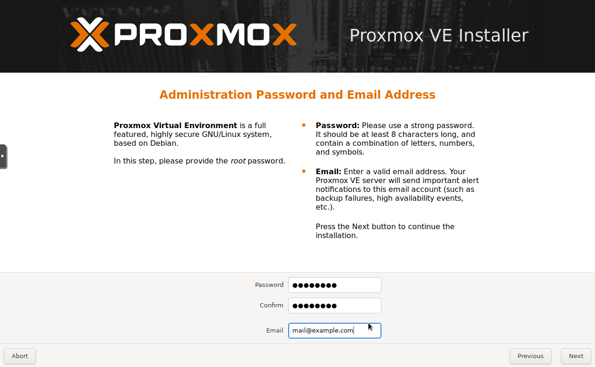
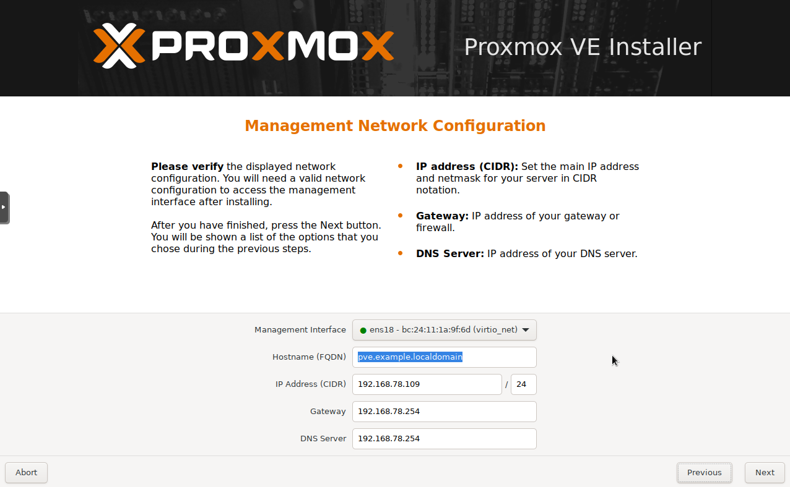
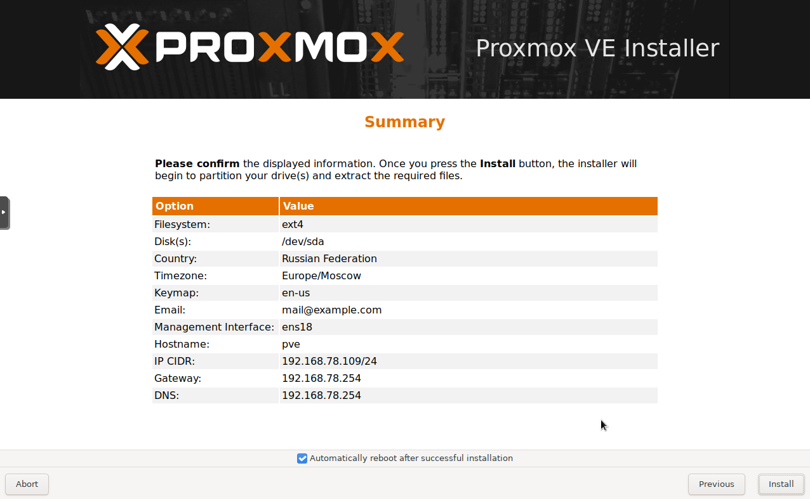
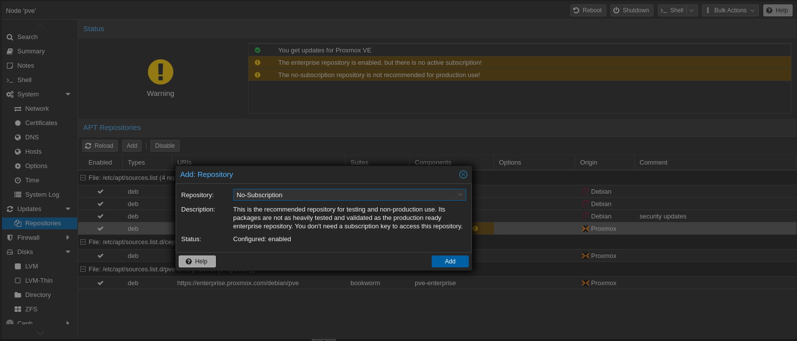

# Установка

## Подготовка

В этом примере рассмотрим установку Proxmox в качестве домашнего сервера, для этого буду использовать старенький ноутбук со следующими характеристиками:

Процессор: Intel Core i5-2450M

ОЗУ: 8 Гб

SSD: 120 Гб

HDD: 500 Гб

Скачиваем образ с [официального сайта](https://proxmox.com/en/downloads) и записываем на флешку с помощью [Rufus](https://rufus.ie/)

## Установка

Установка Proxmox VE похожа на установку любого дистрибутива Linux. Во время установки нужно будет выбрать место установки, применить языковые и региональные настройки, задать пароль для пользователя root

<figure><figcaption><p>Вы увидите приветственный экран. Выберите <strong>Install Proxmox VE (Graphical)</strong> </p></figcaption></figure>

Далее нужно принять лицензионное соглашение

<figure><figcaption><p>Выберите диск, на который будет установлена система. Если вы хотите изменить параметры диска, нажмите «Options» и внесите настройки. Нажмите <strong>Next</strong>, чтобы продолжить</p></figcaption></figure>

<figure><figcaption><p>Выберите страну, часовой пояс и раскладку клавиатуры. Нажмите <strong>Next</strong></p></figcaption></figure>

<figure><figcaption><p>Укажите пароль суперпользователя и email для уведомлений. Нажмите <strong>Next</strong></p></figcaption></figure>

<figure><figcaption><p>Выберите сетевой интерфейс. Задайте имя хоста, IP-адрес, маску подсети, шлюз и DNS Server. Нажмите <strong>Next</strong></p></figcaption></figure>

<figure><figcaption><p>Проверьте заданные параметры. Если данные верны, нажмите <strong>Install</strong></p></figcaption></figure>

Ждем окончания установки... Когда установка будет завершена вы сможете воспользоваться web-интерфейсом, откройте браузер и введите ссылку вида **https://127.0.0.1:8006/**, где **127.0.0.1** — IP-адрес вашего сервера. Эту ссылку можно увидеть при запуске терминала. Для входа введите имя пользователя root и ранее заданный пароль.

## Отключение платных репозиториев

Proxmox VE является программным обеспечением с открытым исходным кодом, он бесплатен и поставляется под лицензией GNU GPL\GNU AGPL. Однако поддержка Enterprise версии платная. Если вы не желаете покупать лицензию, необходимо изменить репозиторий обновлений:

1. Нажимаем на **ваш сервер (PVE).**
2. Заходим в пункт **Repository.**
3. Нажимаем кнопку **Add.**
4. В списке находим **No-Subscription.**
5. В списке репозиториев выбираем _https://enterprise.proxmox.com/debian/pve_ и отключаем его нажав кнопку **Disable**

<figure><figcaption></figcaption></figure>

После этого открываем консоль и выполняем обновление командой

```bash
apt update && apt upgrade -y
```

На этом установка завершена и можно приступать к использованию гипервизора.
