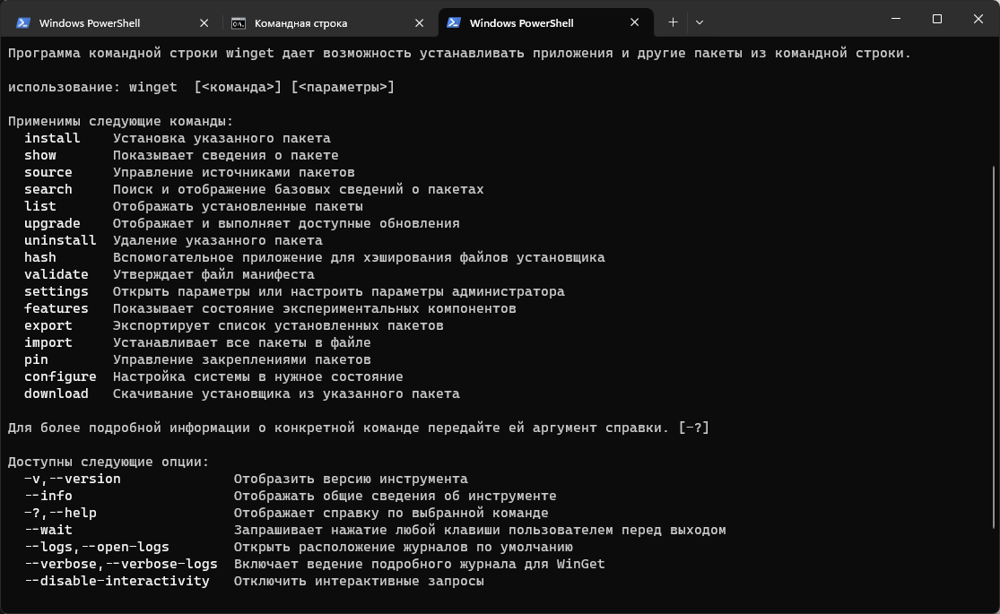
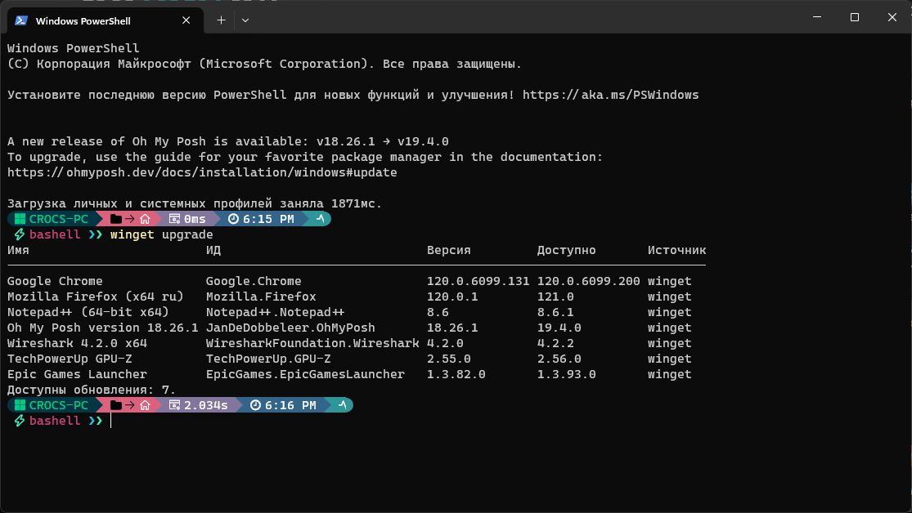
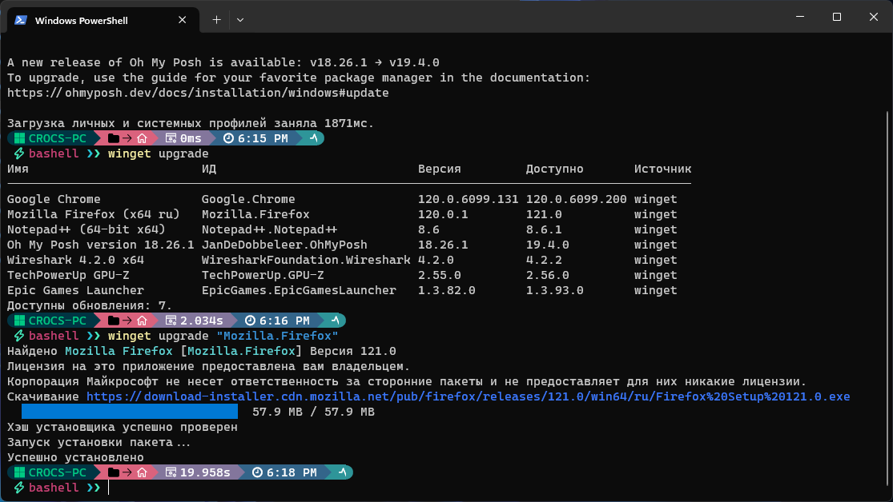

# Обновление приложений Windows при помощи Winget

Windows Package Manager (winget) — это менеджер пакетов пакетов предустановленный в Windows 10 и Windows 11 позволяет устанавливать, обновлять программы и пакеты из командной строки.

Для ее использования нужно, открыть Powershell или Терминал от имени администратора. И ввести команду

```powershell
winget
```

После этого вы увидите подсказки для использования данной консольной утилиты.

<figure><figcaption></figcaption></figure>

В данной статье мы рассмотрим обновление установленных приложений при помощи нее. чтобы проверить список доступных обновлений, введите

```powershell
winget upgrade
```

<figure><figcaption></figcaption></figure>

Чтобы установить все доступные обновления приложений используйте команду

```powershell
winget upgrade --all
```

или

```powershell
winget upgrade --all -h
```

для тихой установки

Чтобы обновить конкретное приложение, например браузер Mozilla Firefox, нужно указать ID пакета

<figure><figcaption></figcaption></figure>

```powershell
winget upgrade "Mozilla.Firefox"
```
